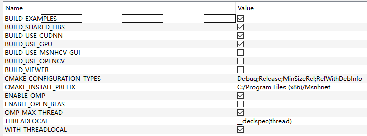
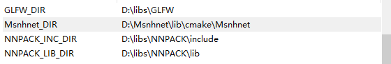
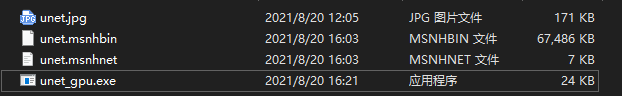

**Note**
- Clone [Msnhnet](https://github.com/msnh2012/Msnhnet).
- Complie **Msnhnet** with CMake 3.15+ (CMake3.17 tested) and 'make install'.

- Set os environment. 
Key: Msnhnet_DIR
Value: [your install dir]/Msnhnet/lib/cmake/Msnhnet

- Make this project with cmake.
- Generate msnhbin file and msnhnet file with Pytorch2Msnhnet.
- copy "unet.msnhbin" "unet.msnhnet" "unet.jpg" files to exe file dir.

- run 
./unet_gpu
